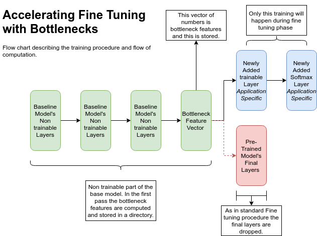

# Fast-image-classification
Fast image classification using Bottlenecks

Image classification can be a daunting task if proper algorithms are not in use. Its well known that `Deep Learning` that to especially `Convolutional Networks` took the computer vision community in a boom. Image classification task is where a given image is put in classified into one of the classes the algorithm is trained on. 


The common way to approach image classification is **fine tuning** (*Transfer Learning*) pre-trained neural networks. Fine tuning a neural network is the process of training pre-trained neural network for our specific task. This is conventionally done by just training the final layers of the CNN (keeping base layers non trainable). 

While keeping the base of the network non-trainable means the weight matrices and bias matrices doenst change. In the finetuning procedure we are doing many unnecessary forward passes in the non-trainable part (base layers) which significanlty increases the time taken to finetune. 

So here we do a first forward pass through the non trainable part of the network and store them (Called bottlenecks). Then with the stored file as the dataset we will be training only the trainable part in the fine-tuning process. This considerable speeds up the classification procedure.

This image summarises the entire idea of using bottlenecks in fine-tuning process.



## Installation Instructions

```bash
cd Fast-image-classification
pip install -r requirements.txt
```

This will install all requirements except opencv. This you can install by 

```bash
sudo apt-get install python-opencv
```

## Functions of different Programs

You can do bottleneck training on all the keras image classification models (keras 2.1.6). This part explains how to use different parts of this program to do classification.

| Program | Function
--- | ---
 general_model.py | Takes care of creating bottlenecks, reading them and training part of the fine-tuning process
 general_test.py | Takes care of integrating the 2 separate parts (non-trainable and trainable parts). Can be used for testing and integration with other applications.
 common_network.py | This contains the actual code for the non-trainable network, the user defined trainable network and also the preprocessing functions. Both `general_model.py` and `general_test.py` use the models defined here.
train_val_split.py | This program can be used to split the dataset into train and validation sets. Look into the program for directory order or else there is a vulnerability of things getting messed up.

## Training your own Classifier

* First choose your base model. This is the model upon which fine tuning will happen. This can be either VGG16, ResNet, InceptionV3, Inception ResnetV2 etc.
* Depending on your problem choose which is the bottleneck tensor. Generally the layer before the softmax activation is used as bottleneck vector. (This is the default option also). By choosing bottneck vector you must choose the layer name in the pre-trained model in keras. (Eg. `activation_31` in ResNet50 basemodel can be a botteneck tensor)

After deciding them (or leaving that to defaults) do the following:

1. In `common_network.py` if you would like to change the trainable part of the network include that in the function**

    ```python
    def transfer_model(bottleneck, LABEL_LENGTH, weights = None):
    ```
    This function holds the definition of the trainable part of the fine-tuning process. 

    By default its just a single layer feedforward network to output (Softmax is the activation function)

2. In case your data isn't split into train and validation sets split them using `train_val_split.py`

```bash
python train_val_split.py --dataset <dataset_folder> --val_split 0.2
```

This code will split the dataset into training set and validation set with ratio $0.8:0.2$.

**Please follow the directory structure given in the program**

1. Once train set and validation set is present, `general_model.py` must be executed. This does the bottlenecks creation job and also training job and saves the checkpoint. **This completes your training your classifier !!**

_Sample Execution_
```bash
python general_model.py --train train_dir --val val_dir --logs log_resnet --bottleneck_dir bottlenecks  --base_model resnet50 --bottlenecks_batch_size 100 --epochs 1 --bottleneck_tensorname activation_31
```

This table illustrates different kinds of arguments available in this program

| Argument | Function |
|---|---|
train | The path to the train set
val | Path to the validation set
logs | Path where the log files will be stored
create_bottleneck | When this flag specified, bottlenecks are created. If you have already computed the bottenecks features and stored them, donot specify this flag.
bottleneck_dir | path where the bottleneck files are stored. (Generally they are **hdf5** compressed)
omit_bottlenecks | If this flag is specified, no bottleneck accelerated training happens. Normal finetuning occurs.
load_weights | Path where the trained weights of the trainable model is present. (Used incase of further fine tuning)
bottleneck_tensorname | Enter the name (layer name in keras) in the base model to select as the bottleneck layer. If not specified, the final layer (just before softmax is chosen)
base_model | This is the base pre-trained model. This has all options from VGG -> ResNet -> Inception -> InceptionResNet etc. Read help command for more details.
batch_size_train | Batch size for training procedure
epochs | No of epochs to train
bottlenecks_batch_size | Batch size used to create bottlenecks (No of images sent per step)

## Testing your trained Classifier

`general_test.py` program specifies a sample test case. You can use that to develop the same. 

_Sample Execution_
```bash
python general_test.py --weight_file Resnet50_top.h5 --label_file essential_files/label_map.json --img_dir val_dir/daisy --base_model resnet50 --bottleneck_tensorname activation_31
```
Note:
* Bottlemeck_tensorname must be same in both training and testing to avoind clashes in shapes.
* Base model must also be same.

Different arguments and its functions are elaborated in the program. Run this to know them.

```bash
python general_test.py --help
```
## References

[How to Retrain an Image Classifier for New Categories](https://www.tensorflow.org/tutorials/image_retraining)  by tensorflow was the main motivation in doing this. Some ideas were taken from there also.

## Future Work

- Multiprocessing for bottleneck (hdf5 files) creation must be done